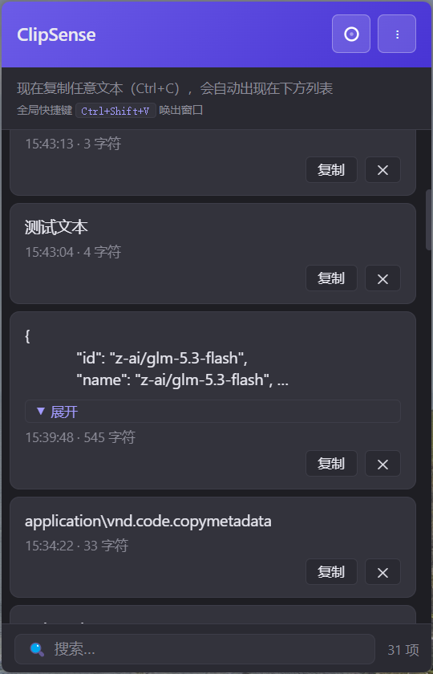

# ClipSense - 剪贴板历史助手

> 复制内容自动归档，搜索历史剪贴板，并将选中的内容快速粘贴到原目标窗口。

**目录名**: `clipboard-spike` | **项目名**: `ClipSense` | **版本**: `0.1.0` | **当前重点**: Windows

---

## ✨ 功能特点

- 📋 **剪贴板监听**：通过主进程轮询系统剪贴板，默认每 `600ms` 检查一次
- 🗂️ **历史归档**：支持文本、富文本、图片和文件条目
- 🔍 **历史搜索**：按文本、预览内容或文件名实时过滤
- 📌 **指定内容粘贴**：双击历史条目，将该条目写入系统剪贴板并发送一次 `Ctrl+V`
- 🧾 **空白字符可视化**：空格、Tab、换行不会显示为空白，使用 `␠`、`⇥`、`↵` 表示
- 🖼️ **图片持久化**：图片独立保存，支持通过 Electron `nativeImage` 读取和回写
- 📁 **文件支持**：文件历史条目可在 Windows Explorer 中定位，也支持回写后粘贴文件
- 🖱️ **边缘唤出**：窗口离开后向最近屏幕边缘推出，保留独立触发条
- ⏱️ **自动隐藏**：鼠标离开面板后按倒计时自动隐藏，默认约 `3 秒`
- 📐 **窗口拖拽**：支持拖拽面板，记录最后使用位置
- 🔒 **加密存储**：使用 Electron `safeStorage` 加密历史数据和图片
- 🎨 **卡通图标**：提供应用图标和托盘图标，适配 Windows 打包
- 🪟 **系统托盘**：后台运行，可从托盘显示/隐藏、固定窗口、调整历史上限和退出

> ClipSense 当前仍是技术可行性 spike，重点验证剪贴板监听、持久化、窗口交互和指定条目粘贴链路，不等同于完整产品。

---

## 🎬 运行效果



---

## 🚀 快速开始

### 环境要求

- Node.js ≥ 18
- npm ≥ 9
- Windows 构建需要 Windows 系统或 GitHub Actions 的 Windows runner

### 安装依赖

```bash
cd clipboard-spike
npm install
```

### 启动开发版本

```bash
npm start
```

开发模式会启动 Electron 应用；当前项目的 `start:dev` 脚本保留用于兼容既有启动方式。

### 构建 Windows 安装包

```bash
npm run build:win
```

构建产物输出到：

```text
build/
```

其中包括 NSIS 安装包和未打包目录。Windows 应用图标使用 `src/renderer/app-icon.png`（`256×256`），托盘图标使用 `tray-icon.png`。

---

## 📖 使用说明

### 基础操作

| 操作 | 方式 |
|------|------|
| **唤出 / 隐藏面板** | 全局快捷键 `Ctrl+Shift+V` |
| **边缘唤出** | 鼠标触碰最近隐藏侧的屏幕边缘触发条 |
| **搜索历史** | 点击搜索框后输入关键词 |
| **复制历史条目** | 点击条目中的复制操作 |
| **粘贴指定条目** | 双击历史条目 |
| **定位文件** | 单击文件条目，在 Explorer 中显示文件位置 |
| **固定窗口** | 点击面板固定按钮或使用托盘菜单 |
| **清空历史** | 使用面板菜单中的清空操作 |
| **退出应用** | 右键托盘图标 → **退出** |

### 双击粘贴流程

双击条目时执行以下流程：

```text
历史列表找到被双击 item
  → 将该 item 写入系统剪贴板
  → 发送一次 Ctrl+V
  → 由原目标窗口完成粘贴
```

Windows 的 `Ctrl+V` 本身没有“指定历史条目”参数，因此必须先写入系统剪贴板。当前实现不会逐字符模拟输入，也不会主动隐藏面板。

> 当前实现会覆盖系统剪贴板，尚未实现 Ditto 式的“粘贴完成后延迟恢复原剪贴板”。

### 文件条目

- 单击文件条目：通过 `shell.showItemInFolder()` 在 Explorer 中定位文件。
- 多文件条目：默认定位第一个文件。
- 双击文件条目：使用文件剪贴板格式写回，再发送 `Ctrl+V`。
- 文件已不存在或被移动时：返回“文件不存在或已被移动”。

### 空白内容显示

历史中保存的是原始内容，界面仅转换预览：

```text
空格 → ␠
Tab  → ⇥
换行 → ↵
```

例如：

```text
␠␠⇥↵
```

不会改变实际粘贴结果。

---

## 🪟 窗口交互与焦点策略

ClipSense 的窗口交互逻辑参考 KeySense 的边缘检测 workflow，并针对剪贴板粘贴场景做了调整：

- 主面板使用 `focusable: false`，默认不抢原目标窗口焦点。
- 显示面板时使用 `showInactive()`，尽量保持原目标窗口作为粘贴目标。
- 鼠标进入面板时取消隐藏倒计时和推出动画。
- 鼠标离开面板时启动自动隐藏倒计时。
- 倒计时结束时会再次确认鼠标已离开，避免边界事件导致误隐藏。
- 拖拽期间暂停边缘检测，拖拽结束后记录新位置。
- 搜索框是例外：用户明确点击后，通过 `focus-search` 临时允许主窗口获取键盘焦点。
- 搜索框双击条目时恢复 `focusable: false`，继续使用选中历史条目执行粘贴。

隐藏状态由两个窗口组成：

```text
mainWindow     主面板，隐藏时完全隐藏
triggerWindow  独立边缘触发条，隐藏后保留在左侧或右侧边缘
```

---

## 🖥️ Windows 多桌面说明

Electron 的 `setVisibleOnAllWorkspaces()` 在 Windows 上不起作用，`alwaysOnTop` 也不等于跨虚拟桌面显示。

当前建议的适配方向是：

```text
用户在哪个虚拟桌面按 Ctrl+Shift+V
  → 获取当前桌面
  → 将 mainWindow / triggerWindow 移到当前桌面
  → 使用 showInactive() 显示
```

真正“固定到所有虚拟桌面”需要 Windows Shell/COM 内部接口，当前尚未纳入 spike，也尚未完成实现和 Windows 实机验证。

---

## 📂 项目结构

```text
clipboard-spike/
├── .github/
│   └── workflows/
│       └── build.yml              # GitHub Actions：语法检查、Windows 构建、Release
├── Docs/
│   ├── 剪贴板持久化方案调研.md
│   └── 剪贴板程序可行性方案与需求调研.md
├── scripts/
│   ├── gen-icon.js                # 生成基础图标
│   └── create-cartoon-logo.py     # 生成卡通应用/托盘图标
├── src/
│   ├── main/
│   │   ├── index.js               # Electron 主进程入口、IPC、托盘和窗口
│   │   ├── clipboard-monitor.js   # 剪贴板读取、分类、去重、历史和回写
│   │   ├── storage.js             # 历史与图片持久化、safeStorage 加密
│   │   ├── edge-detector.js       # 贴边、自动隐藏、推出动画和触发条
│   │   └── input-simulator.js     # Windows Ctrl+V 键盘事件注入
│   └── renderer/
│       ├── index.html             # 面板页面
│       ├── main.css               # 面板样式
│       ├── main.js                # 搜索、固定、倒计时和窗口交互
│       ├── renderer.js            # 历史条目类型化渲染
│       ├── preload.js             # contextBridge 安全桥接
│       ├── app-icon.png           # Windows 应用图标（256×256）
│       └── tray-icon.png          # 托盘图标（16×16）
├── README.md
├── package.json
└── package-lock.json
```

---

## 🛠️ 技术栈

| 组件 | 用途 |
|------|------|
| **Electron 28** | 桌面应用框架 |
| **Electron clipboard** | 读取和写入系统剪贴板 |
| **Electron nativeImage** | 图片剪贴板读取与写入 |
| **Electron safeStorage** | 历史数据和图片加密 |
| **Electron shell** | Explorer 文件定位 |
| **electron-builder** | Windows NSIS 安装包构建 |
| **PowerShell user32.dll** | 发送一次 `Ctrl+V`，避免额外原生 npm 依赖 |

### IPC 通信架构

```text
渲染进程（renderer）
        ↓
contextBridge（preload.js）
        ↓
主进程（index.js）
        ├── ClipboardMonitor：读取、归档和回写
        ├── HistoryStorage：持久化与加密
        ├── EdgeDetector：窗口显示、隐藏和边缘触发
        └── input-simulator：Windows Ctrl+V 注入
```

主要 IPC：

```text
get-history          获取历史
copy-item            回写指定历史条目
simulate-input      回写指定条目并发送 Ctrl+V
open-file-location   在 Explorer 中定位文件
focus-search         允许搜索框获得焦点
mouse-enter         通知鼠标进入面板
mouse-leave         通知鼠标离开面板
set-pinned           设置固定状态
get-countdown        查询隐藏倒计时
```

---

## 💾 持久化与安全

数据目录由 Electron 的：

```javascript
app.getPath('userData')
```

决定，典型文件包括：

```text
clipboard-history.json       历史元数据
clip-images/<id>.bin         独立图片数据
clip-history-config.json     历史上限等配置
```

默认历史上限为 `100` 条，可通过托盘菜单调整为：

```text
100 / 200 / 500 / 1000 / 5000
```

当 `safeStorage.isEncryptionAvailable()` 返回可用时，历史元数据和图片数据使用 Electron `safeStorage` 加密。WSL 或没有系统钥匙串的环境可能降级为明文存储并输出警告。

---

## 🔄 GitHub Actions

工作流文件：

```text
.github/workflows/build.yml
```

触发条件：

- `main` / `master` 分支 push
- Pull Request
- `v*` tag

工作内容：

1. Ubuntu runner 执行 JavaScript 语法检查。
2. Windows runner 执行 `npm ci` 和 `npm run build:win`。
3. 上传 Windows 构建产物。
4. `v*` tag 自动创建 GitHub Release。

---

## 🧪 验证

### 已执行的静态检查

```bash
node --check src/main/clipboard-monitor.js
node --check src/main/edge-detector.js
node --check src/main/index.js
node --check src/main/input-simulator.js
node --check src/main/storage.js
node --check src/renderer/i18n.js
node --check src/renderer/main.js
node --check src/renderer/preload.js
node --check src/renderer/renderer.js
git diff --check
```

### Windows 构建

已在 Windows 环境执行过：

```text
npm run build:win
```

并生成 Windows 安装包。剪贴板粘贴、焦点、Explorer、边缘触发和多桌面行为仍需继续进行 Windows 实机回归测试。

### 手动测试建议

- [ ] 文本复制、历史归档和搜索
- [ ] 空格、Tab、换行内容显示与粘贴
- [ ] 富文本粘贴
- [ ] 图片持久化和跨应用粘贴
- [ ] 普通文件、多个文件和 `.exe` 文件粘贴
- [ ] 搜索框输入后双击历史条目
- [ ] 面板不抢目标窗口焦点
- [ ] 左右边缘触发条宽度、圆角和鼠标命中
- [ ] Windows 多虚拟桌面切换与窗口显示
- [ ] 粘贴后是否恢复原系统剪贴板

---

## ⚠️ 已知限制

| 问题 | 当前状态 |
|------|----------|
| Windows 多虚拟桌面 | 尚未实现真正跨所有桌面显示 |
| 双击粘贴后的剪贴板恢复 | 尚未实现，会暂时覆盖系统剪贴板 |
| `safeStorage` | 无系统钥匙串时降级明文并告警 |
| 图片和富文本 | 已有基础链路，完整跨应用兼容性待实机验证 |
| Explorer / 键盘注入 | 只能在 Windows 实机确认最终行为 |
| WSL GUI | 不作为 Windows 原生行为验证环境 |

---

## 📝 开发计划

- [x] 剪贴板轮询监听
- [x] 文本历史记录和去重
- [x] 历史持久化
- [x] `safeStorage` 加密链路
- [x] 图片独立持久化链路
- [x] 文件条目展示和 Explorer 定位
- [x] 指定历史条目双击粘贴
- [x] 搜索和空白字符可视化
- [x] KeySense 边缘唤出 / 自动隐藏 workflow
- [x] Windows 应用图标和卡通托盘图标
- [x] GitHub Actions Windows 构建 workflow
- [ ] 粘贴后恢复原系统剪贴板
- [ ] Windows 多虚拟桌面适配
- [ ] 完成 Windows 全类型手动回归测试
- [ ] 根据 spike 结果确定正式产品架构

---

## 📜 许可证

MIT License

## 👥 作者

小M & 爪爪 🐾
